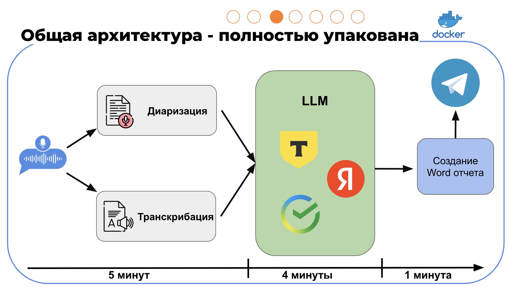
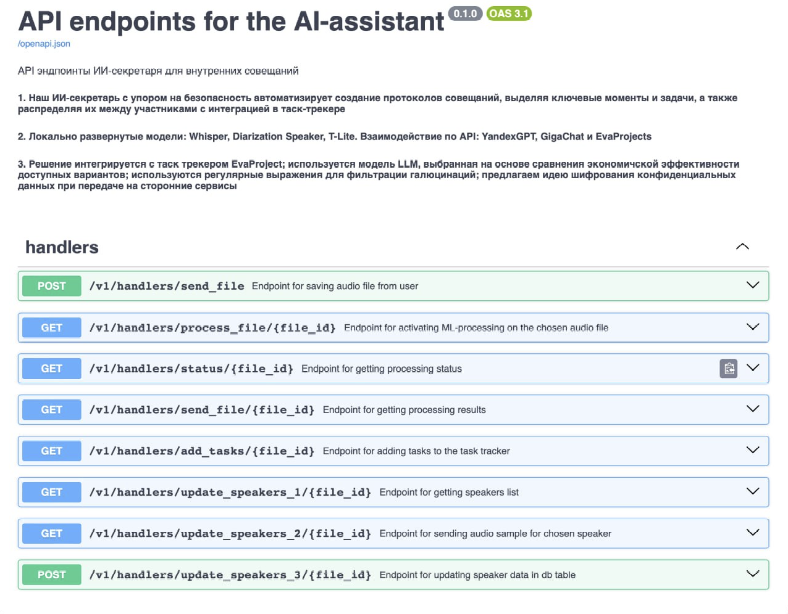

# REU DS CLUB and BSP AI VISION

## ИИ-секретарь для внутренних совещаний

Создание протоколов совещаний — трудоемкий процесс, который отнимает много времени и сил у сотрудников. В ручном режиме велика вероятность потери идей, возникновения ошибок в коммуникации и пропуска важной информации. Большинство существующих решений не могут полностью решить эти проблемы, что приводит к затруднениям в подготовке решений и снижению эффективности работы.

Участникам требуется разработать MVP ИИ-секретаря, реализованное в виде Telegram бота, которое автоматически обрабатывает записи совещаний, генерирует транскрипции, распределяет задачи и формирует итоговые протоколы в нужном формате.
Отдельная задача — определить участников совещания.

## Тэзис
1 Наш ИИ-секретарь с упором на безопасность автоматизирует создание протоколов совещаний, выделяя ключевые моменты и задачи, а также распределяя их между участниками с интеграцией в таск-трекере.

2 Локально развернутые модели: Whisper, Diarization Speaker, T-Lite. Взаимодействие по API: YandexGPT, GigaChat и EvaProjects.

3 Решение интегрируется с таск трекером EvaProject; используется модель LLM, выбранная на основе сравнения экономичской эффективности доступных вариантов; используются регулярные выражения для фильтрации галюцинаций; предлагаем идею шифрования конфиденциальных данных при передаче на сторонние сервисы.

## Презентация с защиты проекта
https://docs.google.com/presentation/d/18xtmQZNhar8BphjdEZ8b-C5yH8LUqIRqfK4KHsik2Dg/edit?usp=sharing

  
  

### Структура репозитория
| **Объект**                      | **Описание**                                                                         |
|---------------------------------|--------------------------------------------------------------------------------------|
| App                             | корневая директория с ключевыми исполняемыми файлами                                 |
| App/Api                         | директория с API-сервисом                                                            |
| App/Bot                         | директория с TG-ботом                                                                |
| App/files                       | директории для вольюмов и хранения файлов                                            |
| App/Postgres                    | директория с конфигурацией БД Postgres и вспомогательными утилитами для работы с ней |
| App/ML                          | директория с ML-утилитами                                                            |
| App/ML/EvaProjectIntegration.py | файл для интеграции с таск-трекером EvaProject                                       |
| App/ML/LLM.py                   | файл для взаимодействия с большими языковыми моделями                                |
| App/ML/Promts.py                | файл для конфигурации ответов языковых моделей                                       |
| App/ML/SpeechProcessing.py      | файл для взаимодействия со Speech2Text-технологиями                                  |
| App/ML/TextTransformation.py    | файл для процессинга текста                                                          |
| App/utils                       | директория со вспомогательными файлами                                               |
| App/main.py                     | входная точка для запуска API-сервиса                                                |
| .gitignore                      | файл для игнорирования файлов при работе с git                                       |
| docker-compose.yml              | файл для сборки сервисов                                                             |
| Dockerfile_Api                  | docker-файл для API-сервиса                                                          |
| Dockerfile_Bot                  | docker-файл для TG-бота                                                              |
| Makefile                        | файл для упрощения работы с деплоем                                                  |
| poetry.lock                     | файл для управления пакетами без конфликтов                                          |
| pyproject.toml                  | файл для управления пакетами без конфликтов                                          |
| README.md                       | документация к репозиторию                                                           |

### Архитектура ML-сервиса

### Описание API-сервиса

### Функционал TG-бота

| **Функционал**                    |
|-----------------------------------|
| добавление файла в сервис         |
| получение результирующих файлов   |
| добавить задачи в Eva Project     |
| просмотр спикеров из записи       |
| редактирование спикеров из записи |
| получение статуса по записи       |

### Витрина в PG

Для работы с ранее загруженными в ИИ-ассистента данными в сервисе организовано хранение аудио-файлов и документов, полученных в результате обработки. В Postgres БД в таблице хранится мета-информация по всем ранее загруженным файлам, технические поля и пути до самих файлов.

file_library

| **Колонка**             | **Описание**                                             | **Тип**   | **Пример**                                                                                                                                                                                                                                                                                                                                                                                                                                                                                                                                                                    |
|-------------------------|----------------------------------------------------------|-----------|-------------------------------------------------------------------------------------------------------------------------------------------------------------------------------------------------------------------------------------------------------------------------------------------------------------------------------------------------------------------------------------------------------------------------------------------------------------------------------------------------------------------------------------------------------------------------------|
| id                      | уникальный идентификатор файла                           | serial    | 52                                                                                                                                                                                                                                                                                                                                                                                                                                                                                                                                                                            |
| file_name               | название файла                                           | varchar   | Встреча 2. Аудиозапись.mp3                                                                                                                                                                                                                                                                                                                                                                                                                                                                                                                                                    |
| audio_path              | путь до аудио файла                                      | varchar   | /files/raw_audio/Встреча 2. Аудиозапись.mp3                                                                                                                                                                                                                                                                                                                                                                                                                                                                                                                                   |
| create_time             | дата и время создания аудио файла                        | timestamp | 2024-09-05 10:08:49                                                                                                                                                                                                                                                                                                                                                                                                                                                                                                                                                           |
| duration                | длительность аудио файла в секундах                      | integer   | 9856                                                                                                                                                                                                                                                                                                                                                                                                                                                                                                                                                                          |
| diarization             | диаризованный вид аудио файла                            | json      | {'0.03, 0.05': {'speaker': 'SPEAKER_01', 'text': 'С вами был Игорь Негода.'}, '0.08, 32.35': {'speaker': 'SPEAKER_01', 'text': ' Приветствую вас, уважаемый Алжа Собаевич, дорогие друзья. Мы рады вас видеть в доме правительства Российской Федерации. И прежде всего хотел бы лично поздравить вас с назначением премьер-министром Республики Казахстан. Для нас важно, что вы первый свой зарубежный визит начинаете с посещения Российской Федерации. Это в полной мере, на мой взгляд, отражает характер особых отношений между Российской Федерацией и Казахстаном.'}, |
| full_text_path          | путь до полной расшифровки                               | varchar   | /files/full_text/Расшифрока_Встреча 2. Аудиозапись.txt                                                                                                                                                                                                                                                                                                                                                                                                                                                                                                                        |
| official_summary_path   | путь до официального саммари                             | varchar   | /files/official_summary/Официальное_саммари_Встреча 2. Аудиозапись.txt                                                                                                                                                                                                                                                                                                                                                                                                                                                                                                        |
| unofficial_summary_path | путь до неофициального саммари                           | varchar   | /files/official_summary/Неофициальное_саммари_Встреча 2. Аудиозапись.txt                                                                                                                                                                                                                                                                                                                                                                                                                                                                                                      |
| speaker_mapping         | сопоставление                                            | json      | {[speaker_1:{''ФИО неизвестно", "Должность неизвестна" ]}, {{speaker_2:[''ФИО неизвестно", "Должность неизвестна" }]}                                                                                                                                                                                                                                                                                                                                                                                                                                                         |
| document                | json-представление расшифрованного и обработанного файла | json      |                                                                                                                                                                                                                                                                                                                                                                                                                                                                                                                                                                               |
| status                  | статус обработки файла                                   | varchar   | получен и загружен                                                                                                                                                                                                                                                                                                                                                                                                                                                                                                                                                            |

### Деплой и управление проектом
1. Управление пакетами, зависимостями и переменными окружения внутри контейнеров происходит через утилиту poetry и файлы pyproject.toml и poetry.lock.

2. Каждый сервис упакован в docker контейнер и общий docker-compose.yml файл, объединяющий сервисы в единую систему.

3. Единый сервис развернут на виртуальной машине и может быть с легкостью перенесен на другой ресурс.

4. Для упрощения работы с проектом есть Makefile со следующими командами:
- сборка проекта в образ (контейнер)
- сохранение образа в архив
- деплой на сервер
- распаковка на сервере
- очистка старых образов

### Команда
| **Участник**       | **Роль в проекте**  | **Телеграм**   |
|--------------------|---------------------|----------------|
| Иванов Александр   | Team Lead, MLE      | @lild1tz       |
| Пашинская Пелагея  | MLE                 | @polyanka003   |
| Агишев Вдадимир | MLE                 | @vladimir_agishev |
| Лариса Латунова | SWE                 | @LarisaLat  |
| Мичурин Артем      | Fullstack           | @artemmichurin |